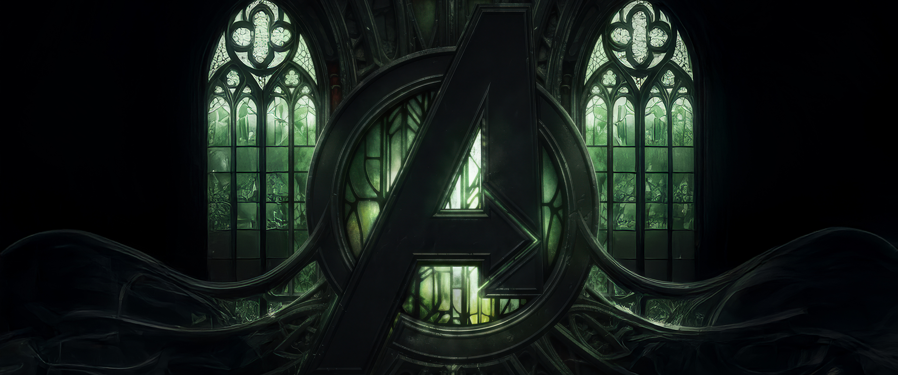

# ❇️ Avengers: Doomsday Countdown

<div align="center">



**Uma contagem regressiva cinematográfica para o lançamento de Avengers: Doomsday**

[Ver Demo](https://avengersdoomsday.vercel.app/) · [Reportar Bug](https://github.com/yourusername/avengersdoomsday/issues)

</div>

---

## 📋 Sobre o Projeto

Este é um projeto **totalmente feito por fã** para celebrar o aguardado lançamento de **Avengers: Doomsday** em 18 de dezembro de 2026. O site apresenta uma contagem regressiva em tempo real com efeitos visuais inspirados no Doutor Destino.

> **⚠️ Disclaimer:** Este projeto não possui nenhuma relação oficial com a Marvel Entertainment, Marvel Studios ou Disney. É apenas uma criação de fã para entretenimento e demonstração de habilidades técnicas.

---

## ✨ Funcionalidades

- ⏱️ **Contagem regressiva em tempo real** com meses, dias, horas, minutos e segundos
- 🔊 **Som de relógio sincronizado** com cada segundo que passa
- 🔔 **Sino especial** quando um mês finaliza
- ⚡ **Efeito glitch** nos números inspirado no Doutor Destino
- ❄️ **Neve verde neon** caindo na tela
- 🌫️ **Névoa verde** animada no fundo
- 📱 **Totalmente responsivo** para desktop e mobile
- 🎨 **Animações cinematográficas** (fade-in, slide-up)

---

## 🛠️ Tecnologias Utilizadas

### Core Stack
- **[Next.js 15](https://nextjs.org/)** - Framework React com App Router
- **[TypeScript](https://www.typescriptlang.org/)** - Tipagem estática
- **[React 18](https://react.dev/)** - Biblioteca UI com hooks modernos
- **[Tailwind CSS v4](https://tailwindcss.com/)** - Estilização utility-first

### Técnicas e APIs
- **React Hooks** - useState, useEffect, useRef, custom hooks
- **Web Audio API** - Reprodução de sons sincronizados
- **CSS Animations** - Keyframes customizados complexos
- **Next.js Image** - Otimização de imagens
- **SSR Hydration Fix** - Padrão isMounted para evitar mismatch

---

## 🎯 Como Funciona

### Contagem Regressiva
O hook customizado `useCountdown` calcula a diferença entre o momento atual e a data de lançamento (18/12/2026):

```typescript
setInterval(() => {
  const difference = targetDate.getTime() - now.getTime();
  
}, 1000);
```

### Sincronização de Som
O som do relógio é sincronizado com cada mudança de segundo:

```typescript
if (previousSecondsRef.current !== seconds) {
  audioRef.current.play(); 
}
if (previousMonthsRef.current > months) {
  sinoRef.current.play(); 
}
```

### Efeito Glitch
Dispara a cada 5 segundos com:
- **RGB Split** (verde metálico + cinza)
- **Spans absolutos** com clipPath dividindo o texto
- **Transform animations** (translateX, skewX)
- Cores inspiradas na armadura do Doutor Destino

### Efeitos Visuais
- **85 flocos de neve** gerados dinamicamente no cliente
- **4 camadas de névoa** com blur(80px) e animações independentes
- **Background zoom** com blur sutil
- **Glitch verde metálico** nos números

---

## 🚀 Como Rodar Localmente

### Pré-requisitos
- Node.js 18+ instalado
- npm ou yarn

### Instalação

```bash
# Clone o repositório
git clone https://github.com/yourusername/avengersdoomsday.git

# Entre na pasta
cd avengersdoomsday

# Instale as dependências
npm install

# Rode o servidor de desenvolvimento
npm run dev
```

Abra [http://localhost:3000](http://localhost:3000) no seu navegador.

---

## 📁 Estrutura do Projeto

```
avengersdoomsday/
├── public/
│   ├── avengers2.jpg      # Imagem de fundo
│   ├── logo.png           # Logo do site
│   ├── relogio.mp4        # Som do tick do relógio
│   └── sino.mp4           # Som do sino (mudança de mês)
├── src/
│   ├── app/
│   │   ├── layout.tsx     # Layout principal + metadata
│   │   ├── page.tsx       # Página inicial
│   │   └── globals.css    # Estilos globais + animations
│   ├── components/
│   │   ├── CountdownTimer.tsx  # Componente do contador
│   │   ├── SnowEffect.tsx      # Efeito de neve
│   │   └── NeonFog.tsx         # Névoa verde neon
│   └── hooks/
│       └── useCountdown.ts     # Custom hook do countdown
└── README.md
```

---

## 🎨 Habilidades Demonstradas

✅ **React Hooks Avançados** - useRef, custom hooks, useEffect cleanup  
✅ **Sincronização Audio/Estado** - Audio API com React  
✅ **CSS Animations Complexas** - Keyframes, clipPath, transforms  
✅ **Responsividade Mobile-First** - Breakpoints progressivos  
✅ **SSR/Hydration Awareness** - Padrão isMounted  
✅ **Performance Optimization** - Lazy loading, tabular-nums  
✅ **Browser APIs** - Audio, Date, requestAnimationFrame  
✅ **TypeScript** - Tipagem forte e interfaces  

---

## 📱 Responsividade

O site se adapta perfeitamente a diferentes tamanhos de tela:

- **Desktop:** Números grandes, gaps espaçosos
- **Tablet:** Tamanhos intermediários
- **Mobile:** Layout compacto, números menores, flex-wrap

```css
gap-1 sm:gap-2 md:gap-4 lg:gap-8
text-2xl sm:text-3xl md:text-5xl lg:text-7xl
```

---

## 🔊 Audio

O site utiliza dois sons:
1. **relogio.mp4** - Tick a cada segundo (volume: 0.9)
2. **sino.mp4** - Badaladas quando um mês finaliza (volume: 0.6, duração: 12s)

> **Nota:** Devido às políticas de autoplay dos navegadores, é necessário clicar no botão "ENABLE SOUND" para ativar os efeitos sonoros.

---

## 🌟 Destaques Técnicos

### Hydration Fix
Evita erros de hidratação SSR/Client usando padrão isMounted:

```typescript
const [isMounted, setIsMounted] = useState(false);
useEffect(() => setIsMounted(true), []);

if (!isMounted) return <div>Loading...</div>;
```

### Performance
- Uso de `useRef` para valores que não trigam re-render
- `tabular-nums` para evitar "pulos" nos números
- Cleanup adequado de intervals e audio
- Next.js Image com `priority` para LCP otimizado

---

## 📝 Licença

Este projeto é de código aberto e está disponível sob a licença MIT.

---

## 👨‍💻 Desenvolvido por

**Pedro Dev** ([@pedrodev](https://github.com/pedroigor09))

Projeto criado com 💚 por um fã da Marvel.

---

<div align="center">

**[⬆ Voltar ao topo](#-avengers-doomsday-countdown)**

*Este é um projeto de fã não oficial e não possui nenhuma afiliação com a Marvel Entertainment.*

</div>

